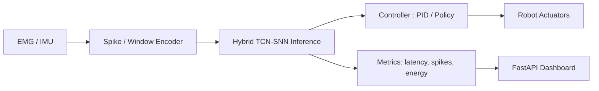

# edge-snn-robot-template

A production-ready template for **SNN/TCN-based edge robotics** projects (ROS2 + snnTorch + FastAPI + Docker).

Focus areas:

- **Latency-aware control** (ms-level end-to-end)
- **Spike / energy metrics** (spike counts, firing rate, synaptic events)
- **Edge deployment** (Jetson / Raspberry Pi / x86 + Docker)
- **Signal-driven control** (EMG / IMU as first-class inputs, vision optional)

## ✨ What this repo gives you

- A **Python “core loop”**: sensor stream → encoder → SNN/TCN → control command
- A minimal **FastAPI inference server** with room for dashboards
- Hooks for **ROS2 nodes** (mobile base or robot arm)
- Tooling for **latency and spike-based energy evaluation**
- A **deployable Docker image** for edge devices

You can treat this as a starting point for:

- EMG-driven **robot arm / manipulator control**
- EMG/IMU-driven **mobile robots** (TurtleBot, diff-drive base)
- Simulation-only pipelines (Gazebo, fake sensors) for algorithm work

## 🧩 Folder layout

- `src/`
  - `models/` – TCN / SNN / Hybrid TCN–SNN models (PyTorch + snnTorch)
  - `control/` – low-latency control loop (policy → command)
  - `infer_server/` – FastAPI app exposing `/infer` and `/health`
  - `io/` – encoders/decoders (e.g. EMG/IMU → spikes, sliding windows)
- `ros2_ws/`
  - ROS2 nodes to bridge topics ↔ inference server
  - Messages/services for commands & sensor streams
- `eval/`
  - Latency benchmark scripts
  - Spike/energy metric tooling
- `deploy/`
  - Dockerfile + `docker-compose.yml` for edge devices (Pi / Jetson / x86)
  - Entrypoint script + env template
- `firmware/`
  - ESP32 / OpenMV example stubs for low-level I/O
- `docs/`
  - MkDocs skeleton (architecture notes, BOM, wiring examples)
- `tests/`
  - `pytest` smoke tests (imports + simple forward pass)
- `notebooks/`
  - Prototyping & analysis notebooks (optional)

CI:

- Lint (ruff)
- Type-check (mypy)
- Unit tests (pytest)
- Docker build

## Architecture

**High-level layout**

- `src/`
  - `models/`: TCN / SNN / Hybrid TCN–SNN models (PyTorch + snnTorch)
  - `control/`: low-latency control loop (policy → command)
  - `infer_server/`: FastAPI app exposing `/infer` and health endpoints
  - `io/`: encoders/decoders (e.g. EMG → spikes, sensor windows)

- `ros2_ws/`
  - ROS2 nodes to bridge topics ↔ inference server
  - messages/services for commands, sensor streams

- `eval/`
  - latency benchmark scripts
  - spike/energy metric tooling

- `deploy/`
  - Dockerfile + docker-compose.yml for edge devices (Pi/Jetson)
  - entrypoint + env template

- `firmware/`
  - ESP32 / OpenMV example stubs for low-level I/O

- `docs/`
  - MkDocs site skeleton (architecture notes, BOM, wiring examples)

- `tests/`
  - pytest smoke tests (import + simple forward pass)


## Quickstart
```bash
# 1) (optional) create repo
git init && git add . && git commit -m "init: edge-snn-robot-template"

# 2) Python env
python -m venv .venv && source .venv/bin/activate
pip install -r requirements.txt

# 3) Run inference server (FastAPI)
uvicorn src.infer_server.app:app --reload --host 0.0.0.0 --port 8000

# 4) ROS2 (optional)
source /opt/ros/humble/setup.bash
cd ros2_ws
colcon build --symlink-install


# 5) Docker build (edge)
docker build -t edge-snn-robot:dev deploy/
docker compose -f deploy/docker-compose.yml up
```

## Architecture


## Roadmap (6 months)
- v0.1: minimal SNN control loop + metrics ([tag](https://github.com/parkjunho12/edge-snn-robot-template/releases/tag/v0.1.16))
- v0.2: vision/EMG input + INT8/TensorRT (working)
- v0.3: edge container + dashboard (soon)
- v0.4: Hybrid TCN–SNN ablation/results (soon)
- v0.5: robustness + fail-safe (soon)
- v1.0: report + kit release (soon)

## License
MIT (see `LICENSE`).
