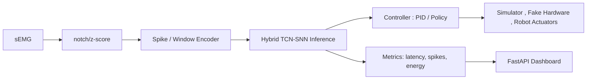

# edge-snn-robot-template

A production-ready template for **SNN/TCN-based edge robotics** projects (ROS2 + snnTorch + FastAPI + Docker).

Focus areas:

- **Latency-aware control** (ms-level end-to-end, **target p95 < 30 ms**)
- **Spike / energy metrics** (spike counts, firing rate, synaptic events)
- **Edge deployment** (Jetson / x86 + Docker) _(Raspberry Pi optional)_
- **Signal-driven control:** sEMG as primary input\*\* (IMU optional, vision removed in v0.2s)

## ✨ What this repo gives you

- A **Python “core loop”**: sensor stream → encoder → SNN/TCN → control command
- A minimal **FastAPI inference server** (batch/stream) with hooks for dashboards
- Hooks for **ROS2 nodes** (mobile base or robot arm)
- Tooling for **latency and spike-based energy evaluation**
- A **deployable Docker image** for edge devices

You can treat this as a starting point for:

- EMG-driven **robot arm / manipulator control**
- EMG/IMU-driven mobile robots (TurtleBot, diff-drive) _(optional IMU)_
- Simulation-only pipelines (Gazebo, fake sensors) for algorithm work

## 🧩 Folder layout

- `src/`
  - `models/` – TCN / SNN / Hybrid TCN–SNN models (PyTorch + snnTorch)
  - `control/` – unified low-latency control (MATLAB simulator / ROS2 / simulation)
  - `infer_server/` – FastAPI inference server (REST + streaming + dashboard hooks)
  - `emg_io/` – EMG loaders (NinaPro), random window sampler, realtime serial stream, spike encoders, preprocessing (z-score, sliding windows)
  - `pipes/` – latency, FPS, CPU usage, spike/energy counters, tegrastats parser
  - `config.py` – central configuration (dataset paths, model, encoder, hyperparams)
- `ros2_ws/`
  - ROS2 nodes to bridge topics ↔ inference server
  - Messages/services for commands & sensor streams
- `eval/`
  - Latency benchmark scripts (PyTorch vs TensorRT, p95 measurements)
  - Spike/energy metric tooling (sparsity, synaptic events)
- `deploy/`
  - Dockerfile + `docker-compose.yml` for edge devices (Pi / Jetson / x86)
  - Entrypoint script + env template
- `matlab_simulator/`
  - 3D robot hand/arm simulators for visual debugging
- `firmware/`
  - ESP32 / OpenMV example stubs for low-level I/O
- `scripts/`
  - dataset/tools (NinaPro download, artifact download, export)
- `examples/`
  - minimal runnable demos (forward pass, spike encoding)
- `docs/`
  - MkDocs skeleton (architecture notes, BOM, wiring examples)
- `tests/`
  - `pytest` smoke tests (imports + simple forward pass)
- `notebooks/`
  - Prototyping & analysis notebooks (optional)
- `output/`
  - logs, latency traces, artifacts, exported results
- `v0_1/`
  - milestone 1 (minimal loop + metrics)
- `v0_2/`
  - milestone 2 (EMG-only + TensorRT + dashboard)

CI:

- Lint (ruff)
- Type-check (mypy)
- Unit tests (pytest)
- Docker build

## Quickstart

```bash
# 1) clone repo
git clone https://github.com/parkjunho12/edge-snn-robot-template.git
cd edge-snn-robot-template

# 2) Python env
python -m venv .venv && source .venv/bin/activate

pip install --upgrade pip
pip install -r requirements.txt

# 3) Download datasets
# ex) s1.mat is training dataset
python scripts/download_data.py --mat s1.mat

# s2, s3.mat can download too
python scripts/download_data.py --mat s2.mat
python scripts/download_data.py --mat s3.mat

# 4) Download artifacts (trained weights, configs, etc.)
python scripts/download_data.py --artifacts

cd v0_1
# v0_1 README.md for details

cd ..

# 5) Test single window(mat file) [Optional]
# 6) Compare models [Optional]
# 7) Export onnx and compare with pytorch
# 8) Validate onnx (Optional)

cd v0_2
# v0_2 README.md for EMG-only + TensorRT pipeline

cd ..

# 9) Run inference server (FastAPI)
uvicorn src.infer_server.app:app --reload --host 0.0.0.0 --port 8000
# Endpoints:
#   GET  /health
#   POST /infer/run         # batch
#   WS   /infer/stream      # sEMG windows → predictions
#   WS   /emg/stream        # raw/processed sEMG (optional)

# 10) Docker build (FAST API)
# Build image
docker build -t edge-snn-robot:dev .

# Run via compose
docker compose -f deploy/docker-compose.yml up

# 11) Matlab simulator (Optional)
# 1. Open MATLAB
# 2. Navigate into the simulator folder:
cd matlab_simulator
# 3. Run the hand simulator:
run_hand_simulator

# 12) ROS2 bridge (optional)
# ROS2 is completely optional.
# If you do not need to connect to a robot or simulator, you can skip this step and use only the FastAPI server.

# 12-a) Native ROS2 (Ubuntu + ROS2 Humble already installed)
source /opt/ros/humble/setup.bash
cd ros2_ws
colcon build --symlink-install

source install/setup.bash
ros2 launch edge_snn_robot robot_control.launch.py \
  server_url:=http://localhost:8000 

# - emg_intent_node → calls FastAPI for inference results and publishes /emg_intent
# - servo_cmd_node → consumes /emg_intent and publishes /joint_cmd
# - fake_hardware_node → subscribes to /joint_cmd and simulates the robot hardware

# 12-b) ROS2 inside Docker (when you don’t have ROS2 locally)
cd ros2_ws
docker compose -f deploy/docker-compose.yml build --no-cache ros2-robot

# local FAST API server
docker run --rm -it --network emg-network  edge-snn-robot:ros2 bash

# docker FAST API server
docker network create {network name} # ex) emg-network 
docker network connect emg-network {FAST API docker container id} # ex) f1fe08ed074878469e06d43dca3f131ba384b41

docker run --rm -it --network emg-network  edge-snn-robot:ros2 bash 


# Inside the container:
pip install requests

# local FAST API
ros2 launch edge_snn_robot robot_control.launch.py \
  server_url:=http://host.docker.internal:8000 

# docker FAST API
ros2 launch edge_snn_robot robot_control.launch.py \
  server_url:=http://{docker container name: ex) test}:8000


```

## MATLAB Simulator
### The repository includes a full 3D MATLAB simulator for robotic hand/arm visualization. This allows you to verify:
- Gesture mappings

- Kinematic correctness

- Wrist + 5-finger motion (17 DOF)

- Servo angle scaling, ranges, and joint indexing

- Real-time playback from ROS2, FastAPI inference, or offline logs

- This is ideal when real hardware is not available, or when validating control logic before deployment.

## Architecture



## Safety & Calibration

- Dead-man: when RMS < rest_threshold → hold/stop
- Velocity & acceleration clamps per joint
- 5-min user calibration: rest → MVC (3×3s) → quick gestures → verify (>90% acc)

## Roadmap (6 months)

- ### ([v0.1](https://github.com/parkjunho12/edge-snn-robot-template/tree/main/v0_1)): minimal SNN control loop + metrics ([tag](https://github.com/parkjunho12/edge-snn-robot-template/releases/tag/v0.1.16))

- ### ([v0.2](https://github.com/parkjunho12/edge-snn-robot-template/tree/main/v0_2)): **sEMG-only input + INT8/TensorRT** 

✓ Requirement: p95 < 30 ms → PASSED  

- ### ([v0.3](https://github.com/parkjunho12/edge-snn-robot-template/tree/main/ros2_ws)): edge container + dashboard
- ### v1.0: report + kit release (soon)


## License

MIT (see `LICENSE`).
