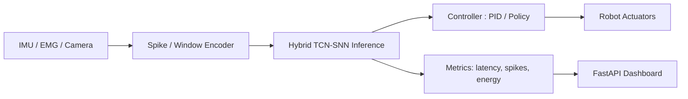

# edge-snn-robot-template

A production-ready template for **SNN/TCN-based edge robotics** projects (ROS2 + snnTorch + FastAPI + Docker).
Focus: **latency**, **spike/energy metrics**, **edge deployment** (Pi/Jetson).

## TL;DR
- `/src`: models, control loop, IO.
- `/ros2_ws`: ROS2 nodes and messages.
- `/eval`: latency/energy metrics tooling.
- `/deploy`: Dockerfile + compose for edge.
- `/firmware`: ESP32/OpenMV stubs.
- `/docs`: MkDocs site; includes BOM options.
- `/tests`: pytest smoke tests.
- CI: lint + unit + Docker build.

## Architecture

**High-level layout**

- `src/`  
  - `models/`: TCN / SNN / Hybrid TCN–SNN models (PyTorch + snnTorch)  
  - `control/`: low-latency control loop (policy → command)  
  - `infer_server/`: FastAPI app exposing `/infer` and health endpoints  
  - `io/`: encoders/decoders (e.g. EMG → spikes, sensor windows)

- `ros2_ws/`  
  - ROS2 nodes to bridge topics ↔ inference server  
  - messages/services for commands, sensor streams

- `eval/`  
  - latency benchmark scripts  
  - spike/energy metric tooling

- `deploy/`  
  - Dockerfile + docker-compose.yml for edge devices (Pi/Jetson)  
  - entrypoint + env template

- `firmware/`  
  - ESP32 / OpenMV example stubs for low-level I/O

- `docs/`  
  - MkDocs site skeleton (architecture notes, BOM, wiring examples)

- `tests/`  
  - pytest smoke tests (import + simple forward pass)


## Quickstart
```bash
# 1) (optional) create repo
git init && git add . && git commit -m "init: edge-snn-robot-template"

# 2) Python env
python -m venv .venv && source .venv/bin/activate
pip install -r requirements.txt

# 3) Run inference server (FastAPI)
uvicorn src.infer_server.app:app --reload --host 0.0.0.0 --port 8000

# 4) ROS2 (optional)
source /opt/ros/humble/setup.bash
colcon build --symlink-install

# 5) Docker build (edge)
docker build -t edge-snn-robot:dev deploy/
docker compose -f deploy/docker-compose.yml up
```

## Architecture


## Roadmap (6 months)
- v0.1: minimal SNN control loop + metrics ([tag](https://github.com/parkjunho12/edge-snn-robot-template/releases/tag/v0.1.16))
- v0.2: vision/EMG input + INT8/TensorRT (working)
- v0.3: edge container + dashboard (soon)
- v0.4: Hybrid TCN–SNN ablation/results (soon)
- v0.5: robustness + fail-safe (soon)
- v1.0: report + kit release (soon)

## License
MIT (see `LICENSE`).
